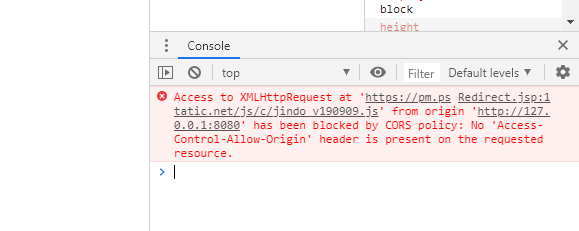
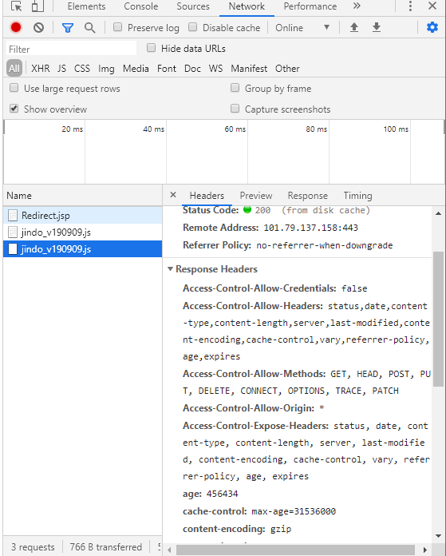

# 2019.12.03

* 보안약점(Weakness) - 원이이 될 수 있는 것
  - CWE DB(https://cwe.mitre.org/)
* 보안취약점(Vulnerability) - 실험결과 - CVE
  * CVE DB(http://cve.mitre.org/)


* ## HTTP 기본 인증 = HTTP Basic Authentication

  * Client -----------------------------------------------------------------------> Server
    GET /HTTP/1.1
    Client <----------------------------------------------------------------------- Server
    															    HTTP/1.1 401 Unauthorized
     	  WWW-Authenticate: Basic realm="Access to the staging site"

    

    **ASK User**

    Client -----------------------------------------------------------------------> Server
    GET / HTTP/1.1

    Authorization: Basic ~ ~ ~ ~ ~

    ​																				**Check credentials**

    Client <----------------------------------------------------------------------- Server

    ​																				  HTTP/ 1.1 200 OK

    ​																									**or**

    ​																	  HTTP/1.1 403 Forbidden

  * ### 단점

    1. 인증정보를 BASE64로 인코딩해서 전송하므로 쉽게 디코딩할 수 있다.
    2. 세션을 유지하지 않는다. 즉, 매 요청시마다 인증정보를 서버로 전달해야하기 때문에 노출이 빈번해지고 유출 가능성이 높아진다. 따라서 보안을 위해 세션을 유지하는 방식(예: Form-based Authentication)을 사용해야한다.


* ## Form-based AUthentication(폼 기반 인증)

  * Client  (ID = "aaa" , PW = "bbb") 
    -----------------------------> login.do?id = "aaa"&PW = "bbb"---> Server

    ​												**일치하는 정보를 조회해서 일치하는 **
    ​												**정보가 존재하면 Session ID를 생성** 
    ​												**후 사용자 관련 정보를 세션에 저장 **

    

    Client <------------------set-Cookie: SID=1234---------------------- Server

    Client -------------------------Cookie: SID=1234---------------------->Server


## HTTP 요청/응답 구조

\r\n = 개행문자 = CR +LF


	### 요청구조

``` 
시작	POST /openeg HTTP/1.1 \r\n				<-방식 URI(URL) 프로토콜/버전
헤더	Referer: /abc.html \r\n					<-요청이 발생한 위치 -> CSRF취약점 방어로 사용
	 Cookie: role=user; \r\n				 <-서버로 부터 부여받은 값을 서버로 전송
	 			:
	 Content-Length: 28 \r\n				 <- 요청 본문의 길이
	 Content-Type: x-www-urlencoded \r\n	 <- 본문의 인코딩 방식을 명시
	 \r\n
(본문)name=hong&age=24	\r\n

```


### 응답구조

```php+HTML
시작 HTTP/1.1 200 OK  \r\n
헤더 Set-Cookie: role \r\n
	Location: main.do\r\n
			:
	Content-Type: text/html\r\n
	Content-Length: 2048 \r\n
	\r\n
본문 <html>
    	<head> .... </head>
    	<body> .... </body>
	</html>
```


#### http 응답분할 (**https://myanjini.tistory.com/90**)

외부 입력값을 응답헤더의 값으로 쓸 수 있는 경우 외부 입력값에 개행문자 포함 여부를 확인하지 않고 응답헤더의 값으로 사용했을 경우 발생하며, 응답이 여러개로 분할되어서 브라우저로 전달된다. 

분할된 응답의 본문 영역에 실행 가능한 코드를 삽입하여 사용자 브라우저를 공격하는데에 활용한다.

```php+HTML
HTTP/1.1 200 OK
Set-Cookie: role=user \r\n
Location: main.do\r\n
... \r\n
\r\n
... <script> ... </script> \r\n
HTTP/1.1 200 OK\r\n
... \r\n 
		:
Content-Type : text/html \r\n
Content-Length: 2048\r\n
\r\n
<html>
    <head>....</head>
    <body>...</body>
</html>

```


### 상태코드

- 1xx: 정보
- 2xx: 성공
- 3xx: Redirect or Forward
- 4xx: Client Side Error
- 5xx: Server SIde Error


### 요청 방식

- 방식 = method  = 클라이언트가 서버에게 전달하는 명력어
  - GET = 서버에게 자원을 요청. 요청 처리에 필요한 값을 주소에 포함해서 전달
  - POST = 서버에게 자원을 요청. 요청 처리에 필요한 값을 본문에 포함해서 전달
  - OPTIONS = 서버에서 사용할 수 있는 Method들을 보여줌
  - HEAD = 헤더만을 불러옴 -> 좀더 빠르게 불러올 수 있고 이를 이용하여 스캐닝을 할 수 있음(구조파악)
  - PUT = 삽입
  - DELETE = 삭제


### 리다이렉트와 포워딩

요청을 다른 요청으로 변경하는 것


1. ##### HTTP 프로토콜을 이용한 리다이렉트

   ```
   [Client]:login ID:____ PW:____
   
   -----------GET /login.do?id=aaa&pw=bbb HTTP/1.1------->login.do  [Server]<----> DB조회
   
   [Client]<----response.sendRedirect("main.do")---일치하는 결과 존재  [Server]
   			 HTTP/1.1 302 Move Temp
   			 Location: main.do
   
   [Client]---------------GET /main.do HTTP/1.1 ---------->main.do	 [Server]
   
   
   [Client]<--------------HTTP/1.1 200 OK -----------------main.do	 [Server]
   ```

2. ##### HTTP 프로토콜을 이용한 포워딩

   ```
   [Client]:login ID:____ PW:____
   
   -----------GET /login.do?id=aaa&pw=bbb HTTP/1.1------->login.do  [Server]<----> DB조회
   
   
   [Client] main.do <--HTTP/1.1 200 OK---일치하는 결과 존재---main.do	[Server]
   ```


* 예시

  * HTML 메타태그를 이용한 리다이렉트

    ```html
    <meta http-equiv="refresh" content="0;url=_______">
    ```

  * Javascript를 이용한 리다이렉트

    ```javascript
    <script>
        location.href="_____";
    </script>
    ```

* 비교
  * 포워드는 서버 내부에서 main.do가 바로 내려간다. 그래서 더 빠름
  * 포워드는 주소가 안바뀌기 때문에 주소에 있는 Parameter들을 활용할 수 있다.


##### 	3. Open Redirect(**https://myanjini.tistory.com/87**)

​		리다이렉트 기능이 제공될 때, 외부 입력 값을 검증, 제한하지 않고 리다이렉트 주소로 사용하는 경우 의도
​		하지 않은 사이트로 리다이렉트가 발생할 수 있기 때문에 피싱과 같은 공격에 악용될 수 있다. XSS(Cross-Site 		Scripting)


## 위험한 형식 파일

* #### 파일 업로드 기능 구현시 주의사항

  * 파일의 크기와 개수를 제한 -> 서버의 연결 자원 또는 디스크 자원을 고갈시켜 정상적인 서비스를 방해
  * 파일의 종류를 제한 -> 서버에서 실행 가능한 파일이 업로드되면 해당 서버의 제어권을 탈취하거나, 악성 코드의 유포지로 악용될 수 있음, 이를 방어하기 위해서는 업로드 파일은 외부에서 접근할 수 없도록 처리하는 것이 답.
  * 업로드 파일의 저장 경로와 파일명을 외부에서 알 수 없도록 처리
  * 업로드 파일의 실행 속성을 제거 후 저장


## 브라우저의 보안 기능

* origin => 스킴 + 호스트 + 포트

  ```
  1) http://www.naver.com/path.file
  2) http://www.naver.com/theotherpath/theotherfile
  3) http://mail.naver.com:8445/path/file
  
  1)과 2)는 동일 기원이다.
  1)과 3)은 기원이 다르다.
  ```

* 웹은 교차 기원 요청(Cross Origin Request)이 가능하다. 
  -> 다른 사이트에서 제공하는 이미지, 스크립트와 같은 코드를 가져와서사용이 가능하다.

  ```html
  
  
  
  ```

* JavaScript를 이용해서 자원을 가져오는 경우는, 동일 기원에 **대해서만** 사용할 수 있도록 **허용**한다.

  ```javascript
  <%@ page language="java" contentType="text/html; charset=EUC-KR"
      pageEncoding="EUC-KR"%>
  <!DOCTYPE html PUBLIC "-//W3C//DTD HTML 4.01 Transitional//EN" "http://www.w3.org/TR/html4/loose.dtd">
  <html>
  <head>
  </head>
  <body>
  
  
  
  
  <script src="https://pm.pstatic.net/js/c/jindo_v190909.js"></script>
  
  	XHR을 이용한 교차 기원 자원
  	<script>
  		var xhr;
  		function makeRequest(url) {
  			xhr = new XMLHttpRequest;
  			xhr.onreadystatechange = makeContents;
  			xhr.open('GET', url);
  			xhr.send();			
  		}
  		function makeContents() {
  			console.log(xhr.responseText);
  			
  		}		
  		makeRequest("https://pm.pstatic.net/js/c/jindo_v190909.js");
  		// makeRequest("http://localhost:8080/openeg/jindo.js");
  	</script>
  
  
  </body>
  </html>
  
  ```

  위와 같이사용한 경우 Console에는 다음과 같은 경고가 뜬다.

  ```
  Access to XMLHttpRequest at 'https://pm.pstatic.net/js/c/jindo_v190909.js' from origin 'http://localhost:8080' has been blocked by CORS policy: No 'Access-Control-Allow-Origin' header is present on the requested resource.
  ```

  

  CORS(Cross-Origin Resource Sharing) - 교차 기원 자원 공유 

  ​	-> SOP 정책을 완화하기 위한 방법
  ​	-> 위에 있는 내용은 CORS 정책에서 조차 막혔기 때문에 경고를 내고 스크립트를 불러오지 않음

  

  ​	CORS정책으로 허가 된 경우 헤더가 다음과 같은 내용을 포함해서 보내줌

  


#### 용어 상세

​	URI(Uniform Resource Identifier) = URL(Uniform Resource Locator) + URN(Uniform Resource Name)
​	보통은 URL로 통용해서 사용함

​	URL구조

```
http://www.naver.com:80/subdir/file.html?parameter1=value1&parameter2=value2#fragment

상세 용어
http:// 										-스킴
www.naver.com 									-호스트
:80												-포트
/subdir/file.html								-경로 및 파일
?parameter1=value1&parameter2=value2			-파라메터 전달
#fragment										-책갈피(문서 내의 위치)
```
