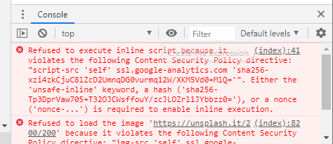
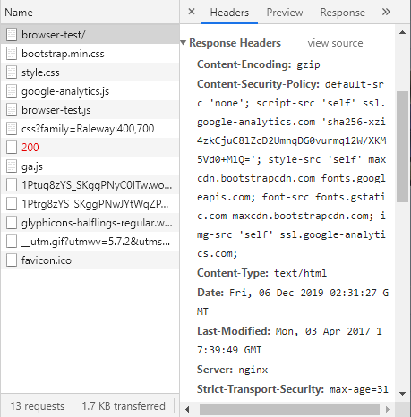

# 2019.12.04


## XSS(Cross-Site Scripting)

<u>공격자가 전달한 스크립트 코드</u>가 사용자 브라우저를 통해서 실행

* 공격자의 스크립트 코드
  * 사용자 브라우저 또는 PC의 정보를 탈취
  * 가짜 페이지를 만들고, 사용자 입력을 유도해서 정보를 탈취
  * 원격지에서 해당 PC를 조정가능하도록 제어권 탈취(ex BeEF)


### XSS 공격 유형

1. #### Reflective XSS(반사 XSS)

   요청이 다음 화면 출력을 위해서 사용되는 경우 발생(ex 검색)

   ex)

   ```html
   ex)
   ID 중복 체크
   ID: abc<script>...</script>[Serach] -----------> search.jsp?id=abc<script>...</script>
   
   "abc<script>...</script>"는 존재합니다... <--------"<%=request.getParameter("id")%>"는 존재
   ```

   공격 예시

   ```html
   <a href="http://localhost:8080/openeg/redirect.jsp?id=abc<script>alert('xss')</script>">자극적인 내용(?)</a>
   
   rhdhttp://192.168.0.2:8080/openeg/naver.jsp
   ```

2. #### Stored XSS(저장 XSS)

   공격자가 전달한 스크립트 코드가 취약한 서버에 저장되고 지속적으로 사용자에게 전달되면서 발생

   ```html
   공격자(글쓰기)
   <script>...</script>-------------------------------------------->글저장(DataBase)
   																<script>...</script>
   희생자(글보기)
   <script>...</script> <-------------------------------------------
   ```


### XSS 공격 방어 방법

1. ##### 입력검증

   ```html
   id=<script>alert(...)</script>...
   ```

   -> HTML 인코딩을 통하여 검증 ->

   '<', '>', '&', ' ' ', '"', ';' 등을 이스케이핑 시킴(다른 문자로 치환해줌)

   * ex) **'<'** -> **&0 또는 &#60 (아스키로 교체), &#lt (Less than)**

2. ##### 출력 검증 - 가장 좋음 그러나 너무 많고 다 막기는 어려움

   ```html
   공격법들
   <script> 공격내용 </script>
   <script src ="공격주소"></script>
    (Event Handler 이용)
   
   등등 다양함(XSS Cheet Sheet)
   ```

   [XSS Cheat Sheet](https://www.owasp.org/index.php/XSS_Filter_Evasion_Cheat_Sheet)

   -> 따라서 Lucy XSS Filter를 이용하여  필터링함 -> 선별적으로 적용을 할 수 있음


## CSP(Content Security Policy, 콘텐츠 보안 정책)

[모질라](https://developer.mozilla.org/ko/docs/Web/HTTP/CSP)가 개발한 표준

개발 목적 : 브라우저에서 XSS 공격 방어가 목표


### CSP의 사용

* XSS 공격은 브라우저가 애플리케이션에 속한 Script와 공격자가 주입한 Script를 구분못한다는 점으로 공격
* 서버에서 제공하는 모든 것은 신뢰하나 콘텐츠 소스의 허용 목록을 생성할 수 있게 해주는 Content-Security-Policy HTTP헤더를 정의하고 브라우저에는 이런 소스에서 받은 리소스만 실행하거나 렌더링 할 것을 지시
  * 실행, 렌더링이 되지 않았음을 알려주는 오류들
    
  * 허용 및 금지를 표시해놓은 헤더 모습(Content-Security-Policy)
    
* [테스트 링크: https://content-security-policy.com/browser-test/](https://content-security-policy.com/browser-test/)


### CSP적용 방법

1. HTTP 응답 헤더에 CSP를 추가

   ```javascript
   <% 
   	 HTTP 응답 헤더에 CSP를 추가
   	 response.setHeader("Content-Security-Policy", "img-src 'self'");
   %>    
   ```

2. 메타 태그를 이용한 CSP 적용

   ```html
   <meta http-equiv="Content-Security-Policy" content="img-src 'self'; script-src 'nonce-abcd';">
   
   <title>Insert title here</title>
   </head>
   <body>
   	
         <!-- 외부에서 가져오는 이미지 -->
   	
   
         <!-- 동일 서버에서 가져오는 이미지 -->
   	
   
   	<!-- 실행을 허가하는 스크립트 -->
   	<script nonce="abcd">
   		alert("OK");
   	</script>
   	
   	<!-- 실행을 불허하는 스크립트 -->
   	<script>
   		alert("NO");
   	</script>
   
   </body>
   </html>
   
   ```


### CSP 지시문(Directive)

* 지시문 종류
  * base-url
  * child-src
  * font-src
  * connect-src
  * font-src
  * form-action
  * frame-ancestor
  * ~~from-src~~ -> child-src로 대신함  

* 소스목록
  * 'none'
  * 'self'
  * 'unsafe-inline'
  * 'unsafe-eval'


### White-list와 Black-List

#### 	예시

* 데이터 a,b,c
  * White-List에 [a] 만 등록되어있을때 -> a
  * Blakc-List에 [b, c]만 등록되어있을 때 -> a


* 데이터가 a, b, c, x, y, z
  * White-List에 [a] 만 등록되어있을때 -> a
  * Blakc-List에 [b, c]만 등록되어있을 때 -> a, x, y, z

  

  #### 특징

  ​	White-List의 장점 : White-List를 썼을때 **항상 동일한 보안성**을 유지할 수 있다.

  ​	Bkack-List의 장점: 모집합(데이터 들의 집합)의 **크기를 예측할 수 없을 때** 유용

