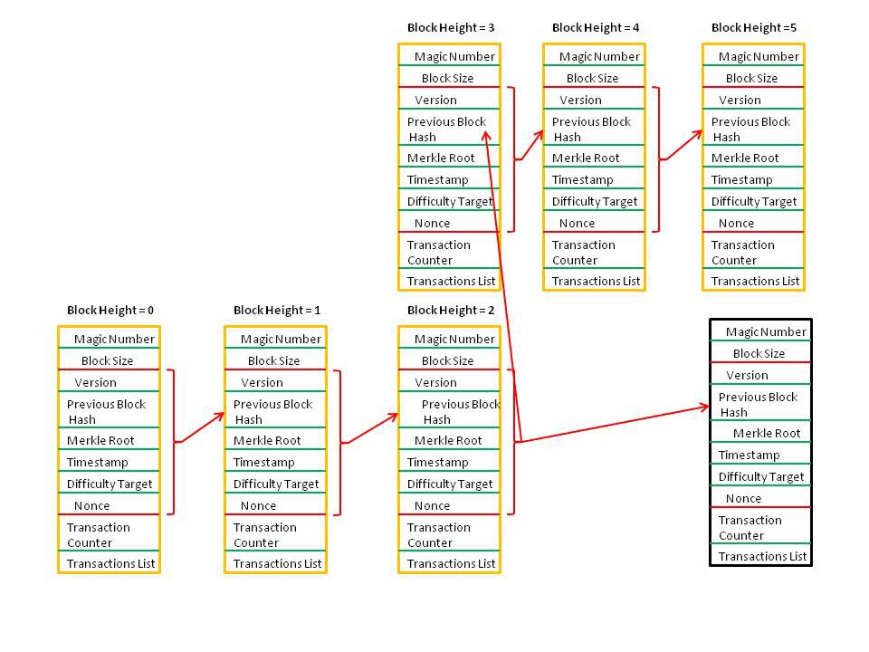
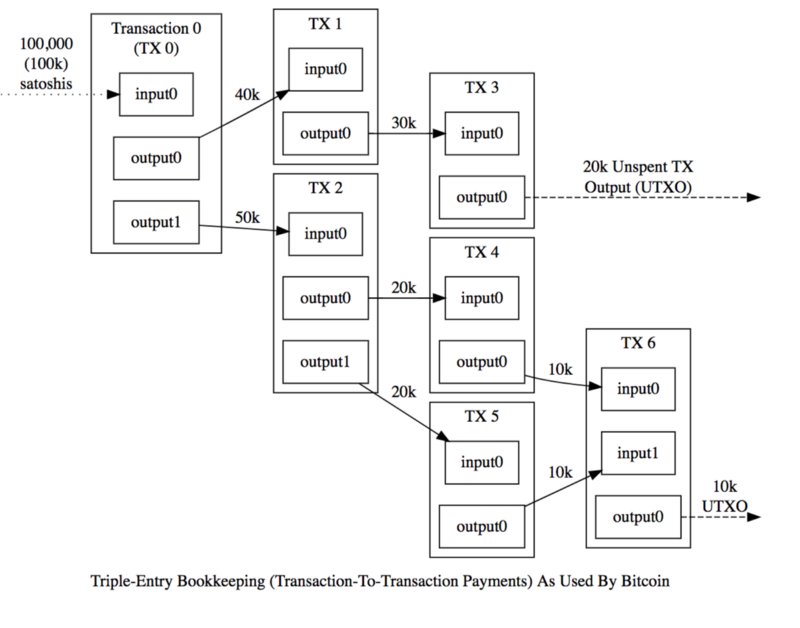
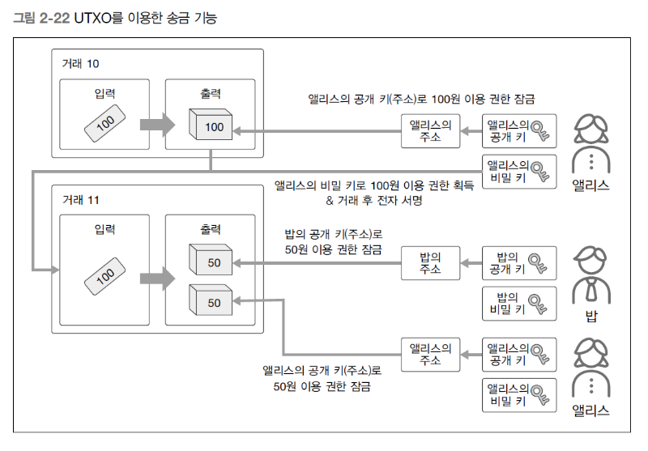
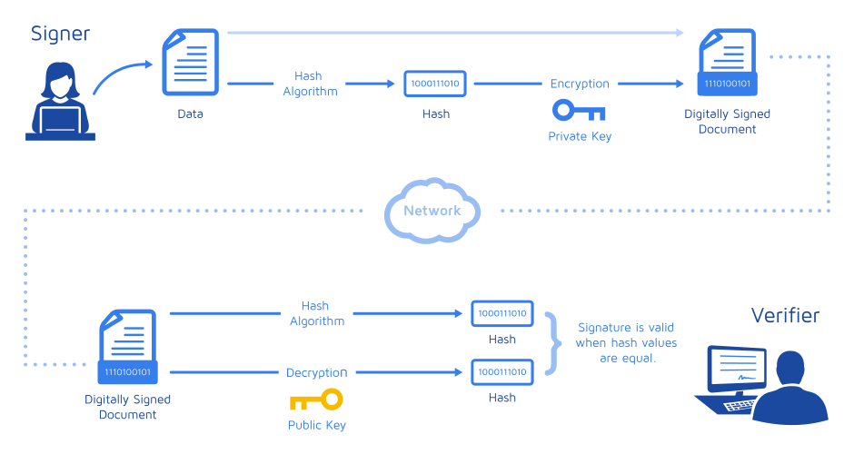
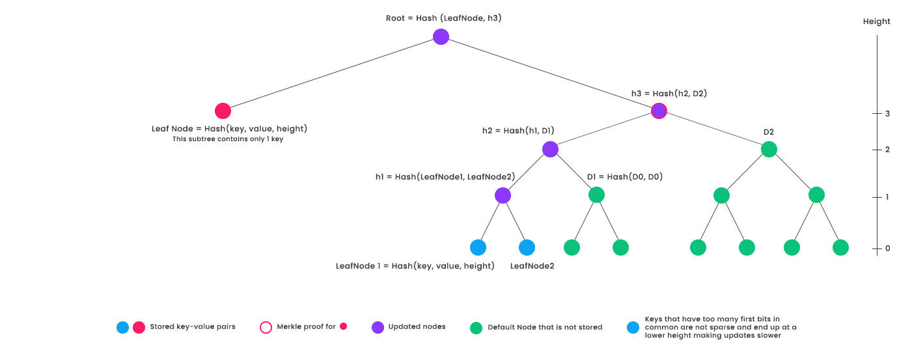

# 2019.12.06


## 비트코인


* #### P2P교환 가능한 전자화폐 구현시 고려사항

  * #### **악의적인 참가자에 의한 부정, 위변조**

    누구나 참가할 수 있는 네트워크에서는 의도적으로 부정한 거래를 만들거나 거래 결과를 자신에게 유리하게 변경하는 악의적인 참가자가 존재할 수 있다.

    * **해결방안**

      * 참가자의 개인키를 이용한 **전자서명**

      * 네트워크 참가자 전원이 모든 거래 이력을 기록한 **장부를 공유**

      * 거래 내역을 담은 블록을 생성할 때 **이전 블록의 해쉬를 포함**

      * 새로운 블록을 만들 때 **계산량이 큰 문제를 풀도록 함**

        

  * **정보 전달의 지연으로 인한 불일치**

    실행된 거래의 결과가 늦게 전달, 공유되어 이중 지불과 같은 불일치 상태가 발생할 수 있다.

    * **해결방안**

      * 네트워크 참자가 전원이 모든 거래 이력을 기록한 **장부를 공유**

      * P2P네트워크에서 블록체인 분기 문제 해결을 위해 가장 긴 블록체인을 채택

        **ㅁ**----**ㅁ**----**ㅁ**--X-ㅁ----ㅁ	  |----**ㅁ**----**ㅁ**----**ㅁ**
         				  |----**ㅁ**----**ㅁ**----**ㅁ**--X-ㅁ

        

  * **네트워크를 자율적으로 유지, 운영하기 위한 추진력**

    누구나 참가할 수 있는 네트워크에 책임있는 관리자가 없으면 시스템 품질(복원성, 가용성)을 유지하면서 운영하지 못 할 수 있다.

    * **해결방안**

      * 막대한 CPU파워에 대한 부담해결을 위해 블록을 만든사람에게 **보상**

      
      

## 비트코인의 거래와 채굴

​				| **1.** 한 사용자가 다른 사용자 계좌로 송금 주문을 넣음(주문에는 공개키와 비밀키, 가상지갑으로 거래를
​				|인증할 프로그램이 필요함)
거래과정| 
​	    		|**2.** 해당 주문은 채굴되기 전 네트워크에서 대기


​				|**3.** 주문들은 헤더와 함께 블록화되어 채굴자들에게 전달
​				|
​				|**4.** 블록의 해쉬값을 먼저 찾기 위해 경쟁함
채굴과정|
​				|**5.** 해쉬값을 가장 먼져 찾은 채굴자는 새로운 비트코인을 얻음
​				|
​				|**6.** 채굴자들이 찾은 해쉬값은 그 다음 주문의 블록에 들어가서 블록체인을 형성


## 블록체인이란?

#### 의미 : 

* [Wikipedia]([https://ko.wikipedia.org/wiki/%EB%B8%94%EB%A1%9D%EC%B2%B4%EC%9D%B8](https://ko.wikipedia.org/wiki/블록체인)): 분산 컴퓨팅 기술 기반의 데이터 위변조 방지 기술
* [Oxford](https://en.oxforddictionaries.com/definition/blockchain): 비트코인 혹은 다른 암호화화폐의 거래가 순차적이고 공개적으로 기록되는 디지털 장부


#### 여러측면에서의 의미:

* 기술적 측면에서: 블록체인은 **공개적으로 열람 가능한 분산 원장을 유지하는 백엔드 데이터베이스**
* 비즈니스 측면에서: 블록체인은 중개자 없이도 **개인(peer)간**의 거래, 가치, 자산 등을 이동시킬 수 있는 **교환 네트쿼크(Exchange network)**
* 법적 관점에서: 블록체인은 거래를 검증해주므로 **종전의 신뢰 보증 기관을 대체하는 수단**


## 블록체인의 장단점

#### 	블록체인 기술의 장점

* ##### 보안성 향상

  * 중앙 데이터베이스 한 곳에서 모든 자료를 저장하는 것 보다 데이터 손실에 대한 위험이 낮음
  * 중앙 집중화된 시스템 관리가 필요하지 않으므로, 내부자에 의한 조작 또는 정보유출 위험이 크게 감소
  * 암호화된 데이터와 암호화된 키 값으로만 거래가 이루어지므로 보안성을 높일 수 있음
  * 새로운 블록은 기존의 블록과 연결되므로 전체 블록안의 데이터 변조와 탈취가 불가능
  * 각 참여 노드의 분산화로 해킹이 불가능

* ##### 안정성 향상

  * 일부 시스템에 오류 또는 성능저하가 발생하더라도 전체 시스템과 네트워크에 영향을 미치지 않음

* ##### 거래 속도 향상

  * 거래의 인증, 증명 과정에서 제 2자를 배제시키는 실시간 거래가 이루어지므로 거래 기록의 신뢰성 확보와 동시에 거래의 효율성 및 속도가 향상됨
  * 분산원장 기술로 실수를 최소화시킬 수 있으므로 오류의 정정과 수정을 위한 시간이 줄어듦

* ##### 비용 감소

  * 중앙 집중화된 시스템이 필요 없기 때문에 비용이 적게 듦
  * 참여자간 직접 거래로 중개 수수료를 절감

* ##### 거래 투명성 향상

  * 모든 참여자들이 거래 장부를 공유하고, 거래 장부에 접근이 가능
  * 네트워크 참여자의 실시간 모니터링이 가능
    

#### 블록체인 기술의 단점

* ##### 처리속도

  * 시간당 거래 처리속도가 제한적

* ##### 저장 공간

  * 모든 거래 기록을 저장해야 하므로 저장 공간이 점점 증가


## 블록체인의 분류

* Public(비트코인)
* Private(비즈니스)

| 구분              | Public(일반적)                                               | Consortium                                                   | Private                                                  |
| ----------------- | ------------------------------------------------------------ | ------------------------------------------------------------ | -------------------------------------------------------- |
| 관리자            | 모든 거래 참여자                                             | 컨소시엄에 소속된 참여자                                     | 한 중앙기관이 모든 권한 보유                             |
| 참여자            | Permissionless<br />불특정  사용자가 참여할 수 있으므로, 악의를 가진 사용자도 참여할 수 있음 | Permissioned<br /> 참여자의 신원이 확인되고, 신뢰할 수 있음  | **<- 동일**                                              |
| 거버넌스          | 한번 정해진 법칙을 바꾸기 매우 어려움                        | 컨소시엄 참여자들의 합의에 따라 법칙을 바꿀 수 있음          | 중앙기관의 의사 결정에 따라 용이하게 법칙을 바꿀 수 있음 |
| 거래 증명         | 거래 증명자가 누구인지 사전에 알 수 없음 <br />Pow, PoS등의 알고리즘에 따라 거래증명자가 결정 | 거래 증명자가 인증을 거쳐 알려진상태<br /> 사전에 합의된 규칙에 따라 거래 검증 및 블록 생성이 이루어짐 | 중앙기관에 의하여 거래 증명이 이루어짐                   |
| 네트워크 확장     | 어려움                                                       | 쉬움                                                         | 매우 쉬움                                                |
| 식별성            | 익명성                                                       | 식별 가능                                                    | 식별 가능                                                |
| 트랜젝션 처리시간 | 상대적으로 오래걸림<br />BitCoin 10분<br />Ethereum 10초     | 빠르게 트랜잭션 처리<br />수초에서 실시간                    | **<- 동일**                                              |
| 유즈 케이스       | 디지털 화폐                                                  | 은행 송금, 증권거래 등 비즈                                  | 니스 네트워크에서 사용                                   |
| 장단점            | 전력 소비가 많음<br />최종성이 없음<br />51% 공격 문제       | 전력소비를 최소화<br />최종성이 있음<br />경량화되어 있으며, 빠르게 처리 | **<- 동일**                                              |
| 구현 예           | BitCoin, Ethereum                                            | Ripple, Hyperideger                                          | **<- 동일**                                              |


* **Public Blockchain**
  * Permissionless
  * 네트워크 참여에 제한이 없음
  * 누구나 블록체인 데이터를 읽고, 쓰고, 검증할 수 있음
  * ex)Bitcoin, 암호화폐
  * 단점 및 제안
    * 돈 세탁이나 밀수품 거래 등에 악용될 수 있음
    * 블록체인을 유지하려면 경제적인 인센티브가 필요 (예: 채굴)
    * 블록체인 프로토콜을 변경하기 위해서는 참여자의 51% 이상이 동의해야 하므로 어려움


* **Private Blockchain**
  * Permissioned
  * 단일 조직에서 운영
  * 읽기, 쓰기, 합의 과정에서 참여할 수 있는 참여자가 미리 지정
  * 중앙기관 한 곳이 모든 권한을 가지며, 네트워크에 참여하기 위해서는 해당 중앙기관의 허가가 필요
  * ex) 은행간 지급 결제 네트워크
  * 장점
    * 느린 거래 속도와 네트워크 확장성 문제 해소
    * Public Blockchain의 단점이나, 위험성을 보완


* **Consortium Blockchain**
  * 여러 조직에서 운영
  * 여러 기관들의 컨소시움으로 구성하는 블록체인
  * 미리 선정된 노드에 의해서 컨트롤되는 반 중앙형 블록체인
  * 미리 선정된 노드들이 권한을 가지며, 노드간 동의가 일어나야 거래가 생성
  * ex) 공급망, 주로 엔터프라이즈 영역에 적용
  * 장점
    * 분산형 구조를 유지하면서 제한된 참여를 통해 보안 강화
    * 네트워크 확장이 용이하고 거래 속도가 빠름


## 블록체인 핵심 기술

* ### 블록

  * 유효한 트랜젝션 정보의 묶음

  * 비트코인 블록 하나에 포함된 트랜잭션 개수: 평균 1400개

  * 비트코인 블록 하나의 평균 크기: 평균 1.14MB

  * 블록 높이: 제네시스 블록(0) 이후 블록이 추가될 떄마다 1씩 증가

  * 블록 깊이(=confirm): 블록(1)이 만들어진 후 새로운 블록이 추가될 때마다 1씩 증가

    | 구성      | 명칭                  | 설명                                                         |
    | --------- | --------------------- | ------------------------------------------------------------ |
    | 블록헤더  | 버전                  | 데이터 구조의 버전                                           |
    |           | 이전 블록 헤더 해쉬   | 블록의 체인구조에서 이전 블록(부모블록)에 대한 해쉬 참조 값  |
    | (80 byte) | 머클루트(Merkle Root) | 해당 블록에 포함된 거래로부터 생성된 머클 트리의 <br />루트에 대한 해쉬<br />(블록에 들어있는 모든 거래의 요약본) |
    |           | 타임스탬프            | 블록의 생성 시간                                             |
    |           | 난이도 목표           | Bit 값으로 블록의 작업증명 알고리즘에 대한 나이도 목표       |
    |           | 난스(nonce)           | 작업 증명 알고리즘에 사용되는 카운터                         |
    | 블록바디  | 트랜잭션 카운트       | 블록에 포함한 트랜젝션 개수(1~9byte)                         |
    |           | 코인베이스 트랜젝션   | 블록 생성시 발생되는 비트코인,<br />해당 블록을 마이닝한 마이너의 수입 |
    |           | 트랜잭션              | 10분 동안 수집한 트랜잭션 정보                               |

    

* ### 블록해쉬

  * 블록의 식별자
  * 블록 헤더 정보를 SHA256 해쉬 함수로 계산한 32바이트 길이의 숫자
  * Previous Block Hash로 들어가는 내용들
    

* ### 블록체인

  * 블록이 이어져서 만들어진 블록의 집합체
  * 블록으로 이루어진 링크드 리스트
    

* ### 트랜잭션

  * 비트코인의 거래 내역
  * 거래 후 남은 잔액이 비트코인이므로, 비트코인의 거래 내역을 기록한 **트랜잭션이 곧 비트코인**이 된다.
    

* ### 코인베이스 트랜잭션

  * 블록을 채굴한 사람에게 보상금을 지급해주는 트랜잭션
  * 이전 출력(지급)이 존재하지 않음
  * 100 확인(confirmation) 이전에는 사용할 수 없도록 제한
    

* ### 일반 트랜잭션

  * 코인베이스 트랜잭션을 제외한 모든 트랜잭션
    

* ### UTXO(Unspent Transaction Output: 미사용 출력)

  * 암호화폐를 저장하는 자료구조
  * 출력(지급)은 됐으나 아직 당사자가 사용하지 않은 상태로 블록에 흩어져 있는 기록
  * 당사자만 쓸 수 있도록 잠금 장치 = **P2PKH**[Pay-To-Public-Key-Hash]
    
  * UTXO 특징
    * 다른 사람에게 일정량의 암호화폐를 받을 때 생성
    * 받은 금액 그대로를 UTXO로 저장
    * UTXO안 일부 금액을 송금할 떄는 새 UTXO를 생성하고 기존 UTXO는 파기
      
  * UTXO를 이용한 송금( 앨리스 -> 밥 50원 전송 )
    

* ### 전자서명

  * 공개키 시스템에서 송신자의 신원을 증명하는 방법

  * 송신자가 자신의 개인키로 암호화한 메시지를 수신자가 송신자의 공개키로 해독

  * 신뢰성, 무결성, 부인방지
    

    * **송신자 검증**: Verifier Decryption 과정에서 Public Key로 열 수 있다는 것은 반드시 Private Key로 암호화 했다는 것.

    * **무결성 검증**: 담겨있는 값의 Hash과 원문의 Hash가 동일하다면 값은 변조되지 않았다는 걸 보장

      

* ### 해쉬함수

  * 임의 길이의 데이터를 고정 길이의 데이터로 매핑하는 함수
  * 일방향성: H(x) = h를 만족하는 임의의 x를 찾는 것이 불가능(**역이 성립하지 않는다**)
  * 충돌회피성: H(x) = H(y)를 만족하는 임의의 x,y를 찾는 것이 불가능(**유일성**)

  
  * #### 종류

    * SHA-256(Secure Hash Algorithm 256bit)
      * 미국 NIST가 개발하여 연방정보처리표준 FIPS 180-4로 표준화한 SHA-2 규격의 일부
      * 256비트(32바이트) 길이의 해시값을 생성
    * RIPEMD-160(RACE Integrity Primitives Evaluation Message Digest 160 bit)
      * 1996년 벨기에의 루벤 카톨릭대학교에서 한스 도버틴(Hans Dobbertin)이 개발한 해시 함수
      * RIPEMD의 최초 버전에서 해시값이 128비트였던 것을 160비트(20바이트)로  확장하고 개량한 것
    * HASH160
      * SHA-256으로 생성한 해시값을 한 번 더 RIPEMD-160으로 해싱한 것
    *  암호화 종류[Link](http://www.fileformat.info/tool/hash.htm)


* ### nonce

  * 블록 헤더 중 유일하게 변경할 수 있는 정보

  * 0에서 시작해서 작업 증명이 완료될 때 까지 1씩 증가시킨다.

  * 오버플로우가 발생하면 새로운 트랜잭션을 추가해서 재시도

    

* ### difficulty

  * 출력된 해쉬값이 가지는 0 배열의 개수

  * 2016개 블록이 생성될 때마다 블록생성시간을 측정해 난이도를 조절
    → 10분당 1~2개의 블록이 생성되는 것을 보장: **0의 개수가 많이질수록 대체적으로 오래걸림**

  * 네트워크의 모든 노드가 동시에 블록을 만들 수 없게 하는 것
    → **오래걸림**

    

* ### 머클트리(Merkle Tree)

  

  * 1979년 랄프 머클에 의해 개발된 이진 해쉬 트리 구조

  * 리프 노드를 두개씩 짝지어서 해시값을 만들고 이렇게 만들어진 해시값을 또 다시 두개씩 짝지어 반복적으로 해시값을 생성 (리프 노드의 개수가 홀수라면 마지막 리프 노드를 복사해서 짝수로 만듦)

  * 규모가 큰 데이터 집합의 완전성을 효율적으로 요약, 검증하는데 사용

  * **머클루트만으로 트랜잭션의 유효성 보장**
    → 빨간색의 유효성 검증을 위해서는 보라색, 파란색들을 이용하면 됨

    

* ### 합의

  모든 참여자의 원장이 일치하는지 확인하는 메커니즘

  * 중앙 집중형(=신뢰 기반)에서의 합의 → 서비스 제공자가 원장을 관리

    * 빠른 서비스 제공이 가능
    * 중앙 기관의 의도 또는 악의적인 사용자의 공격을 통해 기록 조작이 가능

  * 분산 환경(=증명 기반)에서의 합의

    * 비잔틴 장군 문제 해결을 통해 신뢰도 있는 서비스를 제공하는 것
    * 거래 및 거래 실행 순서에 대한 동의
    * 동일한 원장을 유지하기 위하여 검증 참여자들의 상태를 동기화
    * 악의적인 참여자 노드들은 격리
      

  * 합의 알고리즘

    * 비잔틴 장군 문제를 해결함으로써 네트워크에 악의적인 노드가 존재하더라도 **신뢰도 있는 시스템 제공을 보장**

      

  * 작업증명(PoW)

    * 1993년 신시아 도크와 모니 나오에 의해 제안된 개념 - 서비스 거부 공격이나 스팸 등으로 서비스가 남용되는 것을 방지하기 위해 만들어진 기법으로 서비스를 신청하는 자에게 작지 않으면서도 처리 가능한 수준의 과제를 요구(CAPTCHA)

    * 1999년 마르커스 야콥슨과 아리 쥬얼이 쓴 논문에서 처음으로 등장

    * 사토시 나카모토가 처음으로 제안한 비잔틴 합의 알고리즘 → 난스를 찾는 과정

    * 작업(계산) 능력에 의해 채굴 능력(확률)이 결정

    * 느린 속도와 낭비되는 에너지 문제가 심각

      

  * 지분증명(PoS)

    * 가상화폐 PeerCoin에서 처음으로 발표한 합의 알고리즘

    * 지분과 지분이 생성된 날짜에 의해 채굴 능력(확률)이 결정

    * 작업증명 알고리즘의 에너지 낭비 문제를 해결

    * 다양한 알고리즘이 존재

      

* ### 보상

  * 새로운 블록을 블록체인에 추가해 블록에 포함된 모든 거래를 유효한 거래로 확정시켜준 대가

  * 비트코인에서의 보상은 새로 발행되는 비트코인과 해당 블록에 포함되는 거래의 거래 수수료의 합

    

* ### 비트코인의 새로운 발행

  * 채굴자가 블록을 처음 구성할 때 채굴자의 지갑으로 일정량의 비트코인이 입금되는 거래를 그 블록의 첫 거래(generation transaction)로 추가하는 방식

  * 새로 발행되는 비트코인은 최초의 50BTC에서 시작해서 블록체인에 21만개의 블록이 추가될 때마다 절반으로 줄어듦

    

* ### 트랙잭션 수수료

  * 모든 트랜잭션은 수수료를 지불

  * 트랜잭션 당사자끼리 자율적으로 정의

  * 비트코인 코어 v0.12 이전(2016.2.23 이전)에는 트랜잭션 수수료를 내지 않고 거래하는 방법이 존재

  * 최저 수수료: 1,000sat (2017.12 기준)

  * 수수료율 = 트랜잭션 수수료 / 트랜잭션 크기(byte) → 채굴 우선순위 결정에 사용

    

* ### 네트워크

  * 노드들은 항상 가장 긴 체인을 옳은 것으로 간주하여, 그 체인이 계속 확장하도록 작업을 수행
  * 일시적으로 분기가 발생하더라도 이후 3~5개의 블록이 추가되는 과정에서 분기 상태가 해소되고 하나의 블록체인을 유지
  * 채택되지 않은 블록에 포함된 거래는 다시 블록체인에 포함되지 않은 다른 거래들과 동일하게 취급되어 블록에 추가


**블록체인 일부 구현 코드 (JavaScript)**

```javascript
var sha256 = require("sha256");

class BlockChain {
	constructor() {
		this.difficulty = 5; 									//난이도
		this.chain = [];										//블록 저장 리스트
		this.pendingTransactions = [];							//기존의 트렌젝션들
		this.createNewBlock(0, 0, 0);							//제네시스 블록 생성
	}
	/* 블록체인 생성 함수 정의 */
	createNewBlock(previousBlockHash, nonce, hash) {			//새로운 블록 생성
		const newBlock = {
			index: this.chain.length + 1,
			timestamp: Date.now(),
			transaction: this.pendingTransactions,
			nonce: nonce,
			hash: hash,
			previousBlockHash: previousBlockHash
		};
		this.pendingTransactions = [];
		this.chain.push(newBlock);
		return newBlock;
	}
	/* 마지막 블록을 반환하는 함수를 정의 */
	getLastBlock() {
		return this.chain[this.chain.length - 1];
	}
	/* 트랜잭션을 생성하는 함수를 정의 */
	createNewTransaction(sender, recipient, amount) {
		const newTransaction = {
			sender: sender,
			recipient: recipient,
			amount: amount
		};
		this.pendingTransactions.push(newTransaction);
		return;
	}
	/* 해쉬 값 만들기 */
	hashBlock(previousBlockHash, currentBlockData, nonce) {
		const data = previousBlockHash + nonce + JSON.stringify(currentBlockData);
		const hash = sha256(data);
		return hash;
	}
	/* 해쉬값에서 0의 개수가 난이도와 같은가 판단 함수 */
	checkDifficulty(hash) {
		let head = hash.substring(0, this.difficulty);
		return (head.match(/0/g) || []).length == this.difficulty;
	}
	/* 작업 증명 */
	pow(previousBlockHash, currentBlockData) {
		let nonce = 0;
		let hash = this.hashBlock(previousBlockHash, currentBlockData, nonce);
		while (!this.checkDifficulty(hash)) {
			nonce++;
			hash = this.hashBlock(previousBlockHash, currentBlockData, nonce);
		}
		return nonce;
	}
}

const jscoin = new BlockChain();							//블록체인 인스턴스 생성
console.log(jscoin);										//제네시스 블록 생성되었음

jscoin.createNewBlock("0000", 100, "1111");					//새로운 블록 생성: 이전해쉬 "0000", 논스 100 , 해쉬 "1111" 
jscoin.createNewTransaction("aaa", "bbb", 1000);			//aaa에서 bbb로 1000만큼 전송
		
console.log(jscoin);										//현재 까지입력된 블록과 트렌젝션 출력
jscoin.createNewBlock("1111", 200, "2222");					//새로운 블록을 생성하면서 기존의 트랜젝션 목록은 비우고 

console.log(jscoin); 										// 대기 트랜잭션이 사라진 것을 확인
console.log(jscoin.chain[1].transaction);

const previousBlockHash = "previousBlockHash";				//이전 해쉬
const currentBlockData = [									//현재의 블록 - 트렌젝션 목록들
	{ sender : "a", recipient : "b", amount : 100 }, 
	{ sender : "c", recipient : "d", amount : 200 },
	{ sender : "e", recipient : "f", amount : 300 } 
];


const hashBlock = jscoin.hashBlock(previousBlockHash, currentBlockData, 100);			//해시값 하나 만들어봄
console.log(hashBlock);																	//출력

nonce = jscoin.pow(previousBlockHash, currentBlockData);								//이전 블록 해쉬와 트렌젝션 목록들을 이용하여 넌스를 찾아냄					
console.log(nonce);																		//몇번 째가 되면 그 난이도에 만족하는 것을 찾는지 찾음
```


**코드**

```
C:\Program Files\nodejs\node.exe jsCoin.js 
BlockChain {
  difficulty: 5,
  chain: [
    {
      index: 1,
      timestamp: 1575720048214,
      transaction: [],
      nonce: 0,
      hash: 0,
      previousBlockHash: 0
    }
  ],
  pendingTransactions: []
}
BlockChain {
  difficulty: 5,
  chain: [
    {
      index: 1,
      timestamp: 1575720048214,
      transaction: [],
      nonce: 0,
      hash: 0,
      previousBlockHash: 0
    },
    {
      index: 2,
      timestamp: 1575720048218,
      transaction: [],
      nonce: 100,
      hash: '1111',
      previousBlockHash: '0000'
    }
  ],
  pendingTransactions: [ { sender: 'aaa', recipient: 'bbb', amount: 1000 } ]
}

```


# IMG Reference

Img1 : [Link](https://medium.com/all-things-ledger/bitcoins-implementation-of-blockchain-2be713f662c2)
img2 : [Link](https://medium.com/codechain/codechains-utxo-model-fc967901578d)
Img3 : [Link](https://www.hanbit.co.kr/network/choice/editor_choice_view.html?cms_code=CMS6286715893&choice_date=2018-07-10)
Img4 : [Link](https://www.docusign.co.uk/how-it-works/electronic-signature/digital-signature/digital-signature-faq)