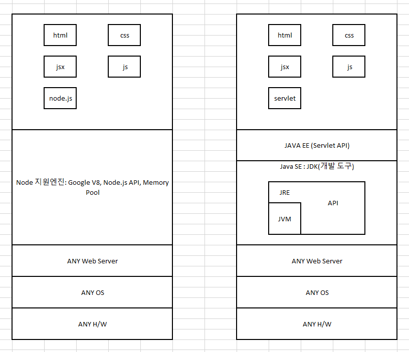

# WebServer의 구조

### 서버간의 통신

클라이언트의 통신을 위해 HTML 사용

비즈니스 모델의 통신을 위해서 XML 사용

### Open API

직접적인 데이터 접근은 피하되 DB에 접근할 수 있는 방법

* [REST](https://ko.wikipedia.org/wiki/REST) 
  * 국내에서 가장 많이 쓰나 비표준
* SOAP
  * 표준