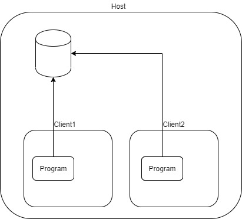

## Docker Structure


**pull**: Docker Hub에서 이미지를 가져온다.

**push**: Docker Hub에 내가 만든 이미지를 올린다.

**build**: Dockerfile에 따라서 Docker Image를 생성한다.

**run**: Docker Image를 이용해서 Docker Container를 생성한다.

**attach**: detach 상태로 생성된 Container에 접근한다.

**exec**: Container에 명령어를 실행한다.

**commit**: Docker Image 현 상태를 Image를 만들어준다.


## Docker Volume

Container 안에다가 데이터를 저장하게 되면  Container가 종료될 시에 데이터가 손실 되게 된다. Virtual Machine에서 Shared Folder를 가지고 가상머신이 종료될 때 데이터가 사라지는 것을 방지한다. Docker에서는 Docker Vloume을 통해서 데이터 손실을 방지한다.


1. #### 호스트의 디렉토리를 공유하는 방법

   -v [호스트 디렉터리 또는 파일]:[컨테이너 디렉토리 또는 파일]
   **마치 파티션 처럼 공유된다.**(기존에 같은것이 있으면 기존 것을 숨기고 대체시킨다)

   

   ```bash
   root@server:~/docker# docker run -d \
   > --name wordpressdb_hostvolume \
   > -e MYSQL_ROOT_PASSWORD=password \
   > -e MYSQL_DATABASE=wordpress \
   > -v /home/wordpress_db:/var/lib/mysql \   
   > mysql:5.7
   ```

   > -v /home/wordpress_db:/var/lib/mysql \ 
   >
   >
   > -v 옵션을 통해서 
   > **/home/wordpress_db**: 호스트의 /home/wordpress_db디렉터리
   >
   > **/var/lib/mysql**: 컨테이너의 /var/lib/mysql의 디렉터리로 공유
   >
   > 컨테이너의 mysq DB데이터를 저장하는 기본 디렉터리 /var/lib/mysql를 공유하는것

   

   ```bash
   root@server:~/docker# echo hello1 >> hello1.txt && echo hello2 >> hello2.txt
   
   root@server:~/docker# docker run -it \
   > --name volume_test2 \
   > -v /root/docker/hello1.txt:/hello1.txt \
   > -v /root/docker/hello2.txt:/hello2.txt \
   > ubuntu:14.04
   ```

   > 파일 단위의 공유도 가능하고, -v 옵션을 여러개 사용하는 것도 가능

   

   * 짧막 TIP
     * VI editor는 파일을 수정할 때 새로운 inode를 만들어서 기존 inode와 교체하는 방식으로 편집을 하는데 echo는 그 inode에 직접 접근하여 수정을 한다. 따라서 파일이 마운트 된 상황에서 vi editor로 호스트 파일을 변경 시키면 게스트 파일이 변경이 되지 않는다. (**이유는 backup파일이 뒤로 빠지고 새로운 파일에 변경된 내용을 저장 시키기 떄문이다.**)

   

2. #### 특정 디렉토리를 공유하는 다른 컨테이너를 다른 컨테이너 들이 공유하는 방법

   --volume-from 옵션을 사용해서 -v 옵션을 적용한 컨테이너의 볼륨 디렉터리를 공유

   --volume-from [다른 컨테이너 이름]

   
   

   * 거쳐가게 되는 컨테이너를 **volume Container** 라고 한다.

   ```bash
   root@server:~/docker# docker run -it \
   > --name volumes-from-container \
   > --volumes-from volume_overide \
   > ubuntu:14.04
   ```

   

3. ##### 도커에서 제공하는 Volume을 이용하는 방법

   -v [볼륨이름]:[컨테이너 디렉터리]

   

   * ##### 볼륨 생성
   
  ```bash
     root@server:~/docker# docker volume create --name myvolume
  ```

​     


   * ##### 컨테이너를 생성해서 볼륨에 파일 추가

     ```bash
    root@server:~/docker# docker run -it --name myvolume_1 \
     > -v myvolume:/root/ \
     >ubuntu:14.04
     ```
     
     > root@server:~/docker# echo Hello, Volume >> /root/hello


   * ##### 다른 컨테이너에서 이전 컨테이너에서 만든 파일 추가
   
     ```bash
     root@server:~/docker# docker run -it --name myvolume_2 -v myvolume:/temp/ ubuntu:14.04
     ```

   

   * docker inspect 명령을 이용해서 볼륨정보 조회
     * docker inspect --type volume myvolume
     
       > root@server:~# docker inspect --type volume myvolume
       > [
       >     {
       >         "Driver": "local",
       >         "Labels": {},
       >         "Mountpoint": "/var/lib/docker/volumes/myvolume/_data",
       >         "Name": "myvolume",
       >         "Options": {},
       >         "Scope": "local"
       >     }
       > ]


## Docker Compose: [Link](https://docs.docker.com/compose/install/)

```bash
# curl -L "https://github.com/docker/compose/releases/download/1.24.0/docker-compose-$(uname -s)-$(uname -m)" -o /usr/local/bin/docker-compose
# chmod +x /usr/local/bin/docker-compose
# docker-compose --version
docker-compose version 1.24.0, build 0aa59064
```


##### 도커 composer를 통해서 yml로 작성된 것을 통해서 실행할 수 있다

```yaml
#docker-compose.yml
version: "3"
services:
    echo: 
        image: myanjini/echo:latest
        ports: 
            - 9090:8080 
```


> docker-compose up		올림
>
> docker-compose down		내림
>
> docker-compose --scale x 	x개의 container를 올림


* YAML

  ```yaml
  version: '3.3'
  
  services:
     db:
       image: mysql:5.7
       volumes:			# -y옵션
         - /home/db_data:/var/lib/mysql
       restart: always
       environment:
         MYSQL_ROOT_PASSWORD: somewordpress
         MYSQL_DATABASE: wordpress
         MYSQL_USER: wordpress
         MYSQL_PASSWORD: wordpress
  
     wordpress:
       depends_on:			#--link
         - db
       image: wordpress:latest
       ports:
         - "8000:80"
       restart: always
       environment:
         WORDPRESS_DB_HOST: db:3306
         WORDPRESS_DB_USER: wordpress
         WORDPRESS_DB_PASSWORD: wordpress
         WORDPRESS_DB_NAME: wordpress
  volumes:
      db_data: {}
  
  ```

  
