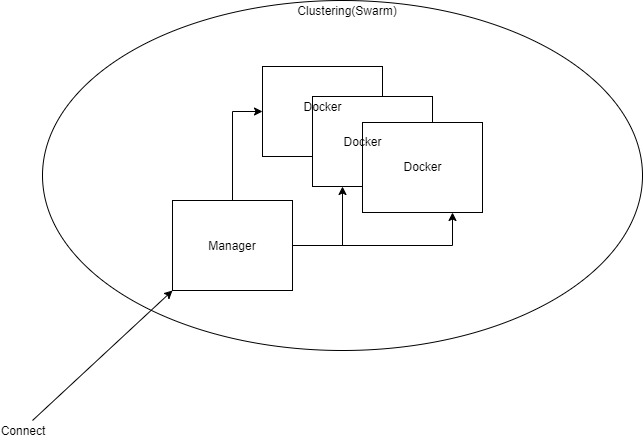

# Docker Swarm




* ##### 일반적인 클러스터의 구성

  * 분산 코디네이터: 각종 정보를 저장하고 동기화(클러스터에 영입할 새로운 서버의 발견, 클러스터의 각종 설정 저장, 데이터 동기화등에 주로 사용)
  * Manager: 클러스터 내의 서버를 관리하고 제어
  * Agent: 각 서버를 제어


* ##### Docker Swarm & Docker Swarm Mode

  * 여러 대의 도커 서버(물리적 서버)를 하나의 클러스터로 만들어 컨테이너를 생성하는 기능

  * Docker Swarm: Docker 1.6버전 이후 부터 사용가능

    * Agent Container가 필요하며 분산 에이전트가 외부에 존재해야 된다. 

    * 여러 대의 도커 서버를 하나의 지점에서 사용하도록 **단일 접근점**을 제공

      

  * Docker Swarm Mode: 도커 1.12버전 이후부터 사용

    * Agent가 Docker자체에 내장( 분상 코디네이터를 외부에 설치할 필요 없음)

    * Clustring 기능에 초점

      

  * Docker Swarm과 Swarn Mode는 3개 이상의 도커 서버를 필요로 함.

  

* ##### 도커 Swarm Mode: 매니저 노드와 워커 노드로 구성

  * 매니저 노드: 워커 노드를 관리하기 위한 도커 노드
  * 워커 노드: 실제 컨테이너가 생성되고 관리되는 도커노드
  * 매니저 노드에도 컨테이너가 생성될 수 있음 = 매니저 노드는 기본적으로 워커 노드 역할을 포함
  * 매니저 노드는 반드시 1개 이상 존재해야 하며, 운영 환경에서 다중화 하는 것을 권장
  * 매니저 노드의 절반 이상에 장애가 발생하는 경우 복구를 위해 클러스터 운영을 중지하므로 매니저 노드는 **홀수개**로 구성하는 것이 효율적

​	

* ##### 확인방법

  ```bash
  root@server:~# docker --version
  Docker version 17.05.0-ce, build 89658be ⇐ 버전이 1.12 이상
  
  root@server:~# docker info | grep Swarm 
  Swarm: inactive ⇐ 
  WARNING: No swap limit support
  ```

  

  

## 사용

* ##### Swarm Manager 측

  ```bash
  root@swarm-manager:~# docker swarm init --advertise-addr 192.168.111.100
  //자신의 IP
  ```

  

  ##### 결과

  >Swarm initialized: current node (wjbpqvzbsmjheruavqo8h9gij) is now a manager.
  >To add a worker to this swarm, run the following command:
  >
  >docker swarm join \
  >    --token SWMTKN-1-1thcpjjhyrgy6odqrayyhcsjdcdxoommnm7wqe7k4j9yah0ik5-bwb42xqm98o4mskyb8o6cmv9r  192.168.111.100:2377
  >
  > 새로운 워커 노드를 클러스터에 추가할 때 사용하는 비밀키(토큰)


* ##### 각 노드들

  ```bash
  docker swarm join \
      --token SWMTKN-1-1thcpjjhyrgy6odqrayyhcsjdcdxoommnm7wqe7k4j9yah0ik5-bwb42xqm98o4mskyb8o6cmv9r  192.168.111.100:2377
  ```

  

  ##### 결과

  > docker swarm join \
  >
  > --token SWMTKN-1-66r2jffdm56b851ot6v6b8cclw033yuck9sa4u8sjssh54qzb1-08g05mbte5ksuaptse9wqkr1d 192.168.111.100:2377 This node joined a swarm as a worker.


* ##### 노드들 확인

  ```bash
  root@swam-Manager:~# docker node ls
  ```

  ##### 결과

  > ID                            HOSTNAME            STATUS              AVAILABILITY        MANAGER STATUS
  > 28brbpkdivfba3q1y8w86gobm *   swam-Manager        Ready               Active              Leader
  > ld1di42va66twvki4ymrmklqb     swam-worker1        Ready               Active              
  > lyka3kfxstsrx85cdjhq9qgke     swam-worker2        Ready               Active    


* ##### 스웜 탈퇴

  ```bash
  root@swam-worker1:~# docker swarm leave
  Node left the swarm.
  ```

  ##### 결과

  > root@swam-Manager:~# docker node ls
  >
  > ID                            HOSTNAME            STATUS              AVAILABILITY        MANAGER STATUS
  > 28brbpkdivfba3q1y8w86gobm *   swam-Manager        Ready               Active              Leader
  > ld1di42va66twvki4ymrmklqb     swam-worker1        **Down**                Active              
  > lyka3kfxstsrx85cdjhq9qgke     swam-worker2        Ready               Active  


* ##### 노드 삭제

  ```bash
  root@swam-Manager:~# docker node rm swam-worker1
  swam-worker1
  
  root@swam-Manager:~# docker node ls
  ID                            HOSTNAME            STATUS              AVAILABILITY        MANAGER STATUS
  28brbpkdivfba3q1y8w86gobm *   swam-Manager        Ready               Active              Leader
  lyka3kfxstsrx85cdjhq9qgke     swam-worker2        Ready               Active           
  ```

  

* ##### 매니저 탈주

  ```bash
  root@swam-Manager:~# docker swarm leave
  Error response from daemon: You are attempting to leave the swarm on a node that is participating as a manager. Removing the last manager erases all current state of the swarm. Use `--force` to ignore this message.
  root@swam-Manager:~# docker swarm leave --force
  Node left the swarm.
  root@swam-Manager:~# docker node ls
  Error response from daemon: This node is not a swarm manager. Use "docker swarm init" or "docker swarm join" to connect this node to swarm and try again.
  root@swam-Manager:~# ^C
  root@swam-Manager:~# 
  ```

  * ##### 그에 따른 node의 반응

    ```bash
    root@swam-worker2:~# docker swarm init
    Error response from daemon: This node is already part of a swarm. Use "docker swarm leave" to leave this swarm and join another one.
    ```

  

* ##### 매니저 권한 해제 및 부여

  * ##### 최소 한명의 매니저가 있어야 한다.

    ```bash
    root@swam-Manager:~# docker node ls
    ID                            HOSTNAME            STATUS              AVAILABILITY        MANAGER STATUS
    50189gl7amzqekq5c6ze3c6qh *   swam-Manager        Ready               Active              Leader
    jrhj5ss4gemcr2519x86n3fqm     swam-worker1        Ready               Active              
    vphuxxiqcoizlkiwwvd4g305j     swam-worker2        Ready               Active              
    root@swam-Manager:~# docker node demote swam-Manager
    Error response from daemon: rpc error: code = 9 desc = attempting to demote the last manager of the swarm
    ```

    

  * ##### 권한에 관한 명령어

    ```bash
    docker node promote  ⇒ 워커 노드를 매니저 노드로 변경
    docker node demote   ⇒ 매니저 노드를 워커 노드로 변경
    ```

    

  * ##### 매니저 권한 부여

    ```bash
    root@swarm-worker1:~# docker node promote swam-Manager
    Node swarm-manager promoted to a manager in the swarm.
    root@swarm-worker1:~# docker node demote swam-worker1
    Manager swarm-worker1 demoted in the swarm.
    ```

  

  

* **서비스 생성**

  ```bash
  //Echo 예제
  root@swam-Manager:~# docker service create \
  >  ubuntu:14.04 \
  >  /bin/bash -c "while true; do echo Hello Docker; sleep 1; done"
  ```

  

* **서비스 확인**

  ```bash
  root@swam-Manager:~# docker service ls
  
  ID                  NAME                MODE                REPLICAS            IMAGE               PORTS
  mxexrgmryy9p        youthful_tesla      replicated          0/1                 ubuntu:14.04    
  
  root@swam-Manager:~# docker service ps youthful_tesla
  ID                  NAME                IMAGE               NODE                DESIRED STATE       CURRENT STATE            ERROR               PORTS
  qwb9zbvyd3ge        youthful_tesla.1    ubuntu:14.04        swam-Manager        Running             Running 48 seconds ago   
  ```

  

* **현재 swam-Manager의 컨테이너 목록 확인**

  ```bash
  root@swam-Manager:~# docker container ls
  CONTAINER ID        IMAGE               COMMAND                  CREATED             STATUS              PORTS                  NAMES
  b06661d1df4e        ubuntu:14.04        "/bin/bash -c 'whi..."   3 minutes ago       Up 3 minutes                               youthful_tesla.1.qwb9zbvyd3getpj90yk5j4a60
  69ffa223667f        kiheyunkim/hello    "nginx -g 'daemon ..."   2 hours ago         Up 2 hours          0.0.0.0:8000->80/tcp   test
  ```


  **현재는 swamManager에서 실행된 것으로 나오고 있는데 어디서 실행되는지는 중요하지는 않다. 노드중에 어디서든지 돌릴 수 있음**.


# Swarm 이용

* 2개의 서비스 생성

  ```bash
  root@swam-Manager:~# docker service create \
  > --name myweb \
  > --replicas 2 \				-> 컨테이너 개수
  > -p 8080:80 \
  > nginx
  kpcavixjep194osguphxia86n
  Since --detach=false was not specified, tasks will be created in the background.
  In a future release, --detach=false will become the default.
  
  --------------------------------------------------------------------------------------
  
  root@swam-Manager:~# docker service ls
  ID                  NAME                MODE                REPLICAS            IMAGE               PORTS
  kpcavixjep19        myweb               replicated          2/2                 nginx:latest        *:8080->80/tcp
  
  --------------------------------------------------------------------------------------
  
  root@swam-Manager:~# docker service ps myweb
  ID                  NAME                IMAGE               NODE                DESIRED STATE       CURRENT STATE                ERROR               PORTS
  r9rr34sb8iz1        myweb.1             nginx:latest        swam-worker2        Running             Running about a minute ago                       
  2r8q9uljpq5j        myweb.2             nginx:latest        swam-Manager        Running             Running about a minute ago 
  ```

  

* **ngix로 접속**

  > http://swarm_manager_ip:8080/
  >
  > http://swarm_worker1_ip:8080/
  >
  > http://swarm_worker2_ip:8080/
  * 방화벽 열어야 할 것들
    * 2377 TCP 클러스터 관리
    * 7946 TCP/UDP 노드간 통신
    * 4789 UDP 네트워크 트래픽 overlay

  

  * 컨테이너 실행 여부와 관계 없이 접속을 확인
  * 각 호스트의 어느 노드로 접근하든 실행 중인 컨테이너로 접속한다.
  * 스웜 모드는 라운드 로빈 방식으로 서비스 내에 접할 컨테이너를 결정

* 특정 서비스 레플리카 증가

  ```bash
   docker service scale myweb=3
  ```

  


## 생성시에..

복제 모드 서비스 - 정의한 리플리카의 개수 만큼 컨테이너가 생성.(default)

글로벌 모드 - 모든 노드에 컨테이너를 생성하는 것을 의미


## 서비스 장애 복구

#### #1 매니저에서 실행중인 Container를 삭제해봄

	>root@swam-Manager:~# docker kill bedb


#### #2 복구를 스스로 하고 기록이 남음


#### #3 노드를 죽였을 때(Worker1: 서비스 종료)


다른 노드로 위임된다.


#### #4 Worker1 서비스를 다시 시작하면?

연결은 되나 Container에 변화는 없다.


#### #5 실행중인 하나의 컨테이너를 죽이면 Worker쪽으로 다시 또 분배된다.


##### *메뉴얼 상에서는 바로 분배되지 않고 scale을 조정했을 때만 할당할 수 있다.


## 서비스 롤링 업데이트

##### #1 nginx 1.10 버전 설치


##### #2 서비스 업데이트


##### #3 업데이트 조건 지정

> docker service create \
>
>  --replicas 4 \
>
>  --name myweb3 \
>
>  --update-delay 10s \
>
>  nginx:1.10


## 서비스 롤백

docker service --update --rollback 서비스이름


